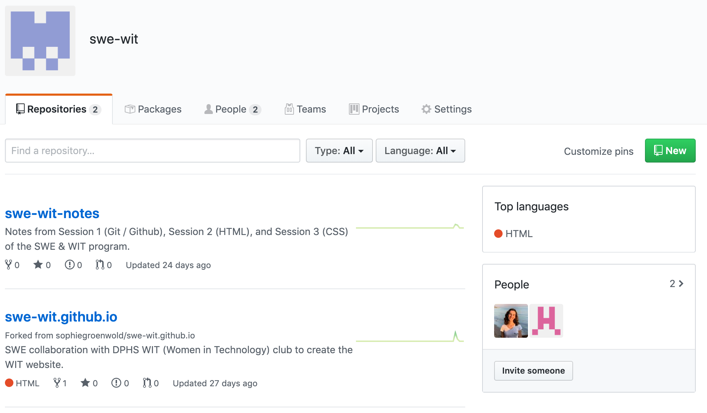

# Session 1: Git

*Teaching curriculum for SWE & WIT website building program.*  

---

## Outline of Topics

- Join our Github organization
- What if I can't join the Github organization?
- How to code in a file?
- Today's coding
- Extra materials
    - What commands can you use?
        - `git push`
        - `git pull`
    - What are merge conflicts and how do we avoid them?

---

## Prereqs: Join our Github organization

Since you all set up your Github accounts before, I've invited you to the `swe-wit` organization. To edit our files you'll need to accept that invitation. 

Log in to your Github account!

→ *If you do not remember your credentials or do not have an account, visit [bit.ly/pre-session-1-md](http://bit.ly/pre-session-1-md) and start at **How do I get started with Git & Github?***

Visit [https://github.com/swe-wit](https://github.com/swe-wit).

You should see a banner at the top of the page saying I've invited you to join `swe-wit`. Click *View* and then *Join swe-wit.* You should now see this page:

Click on the [swe-wit.gitub.io](https://github.com/swe-wit/swe-wit.github.io) repo, and complete the following steps from our Pre-Session 1 notes (if you haven't already):

## Clone the repo

The last thing we're going to do is to clone this repository from the remote repository to your local computer. 

- **Clone:** this basically means the same thing as copy!
- **Remote:** existing on Github.
- **Local:** existing on your computer.

There's a big, green button on the left-hand side that says *Clone or download.* Click that and copy the weird stuff in the box. 

Then, open a *command-line interface.* On my Mac, it's called *Terminal,* and it looks like this:

You just open it like you would any other app.

If you're using a different computer / operating system, there should still be a command line application available. I think on Windows it's called "Command Prompt."

Type the following:

`git clone [paste what you copied!]`

and then hit enter. Now when you type `ls` (which is short for list), you'll see a list of your files, including `swe-wit.github.io`.

You now have the repository downloaded onto your local computer.

## What if I can't join the Github organization?

***If you do not see a banner at the top of your page,*** then there is a problem with your Github account receiving organization access. It's not especially important to learn the basics of Git today, but for long-term development you'll want to join the organization. Make sure you give Alessa your Github username so we can look into the problem!

For today, visit the [swe-wit.gitub.io](https://github.com/swe-wit/swe-wit.github.io) repo and clone it using the same steps as above. 

## How do I code in a file?

There are many *text editors* that will let you do this. We're going to use one that you can open from your command line, called *vim.* 

To try it, type `vim index.html`. You should see this:

index.html opened using vim. 

You can use your arrows to go back and forth. To edit the file, press `i` to enter *insert mode.* 

When you're done, press `esc` + `:wq` to save and quit, or `esc` + `:q` to quit without saving.

**Vim is a text editor that we use to change code files. There are other options you can use if you'd like, but they may take additional installations.*

## For today: create a branch, and sign your name

Today, we're going to change that code so that each of you signs your name on a version of it. The final result will look something like:

But with your name, of course.

One of the biggest problems of coding with a group is making conflicting changes that don't work together. These are called *merge conflicts* (see below for more information)*.* For today's purposes, all of us will be making different versions of our repo on separate *branches* to avoid this. 

→ What is a branch in Git?

A parallel version of your code that does not disrupt the original version. If we like this parallel version, we can merge it back with the original version (what we call the *master branch*).

So each of you is going to make your own branch to sign your name, but not merge it with the master branch (that would create a merge conflict!). 

From inside the `swe-wit.github.io` repo in your command line, type 

`git checkout -b sg-HelloWorld` *(but use your initials instead of* `sg`*)*

You're now on a new branch! To edit the file, remember to type 

`vim index.html`

And then edit the stuff inside of the `
` tags to say `Hello, World! - YourName`.

Now when you save and open `index.html` in your browser, you should see your own version of the website. 

We want these changes to be reflected on Github, without merging them to master. So we type the following on the command line:

`git add index.html`

`git commit -m "signed index.html"`

`git push origin sg-HelloWorld` *(but remember to use your own initials!)*

Now on Github, when you select the following drop-down menu, you should see your own branch as a parallel version of the code. 

For today, that's all we're going to do! Make sure that on your command line, you do

`git checkout master`

To switch back to the master branch for any new work you want to do. 

Thanks guys!

---

## How do I update the changes I've made to the repository I see on Github?

When inside the `swe-wit.github.io` directory on your computer, type the following:

`git add .`

`git commit -m "[your message here]"`

`git push origin master`

*the `.` in the first command means "all files"

*the `"[your message here]"` in the second file is a little message you enter to talk about what's been updated.

## How do I bring new changes that exist on Github onto my own computer?

When inside the `swe-wit.github.io` directory on your computer, type the following:

`git pull origin master`

And your directory should update to match the repository on Github.

## What are merge conflicts?

We have to be careful when working with many other people on the same project! Sometimes multiple people try to update the remote repository with their individual changes at the same time. 

This can lead to *merge conflicts*, which are when people try to push their competing versions to Github. It's ok if this happens — Git is designed to handle these situations (let us know and we'll help you). 

But to avoid merge conflicts, make sure you communicate about who is working and when, and:

1. *always push your changes when you are done working.*
2. *always pull when you begin working.*
